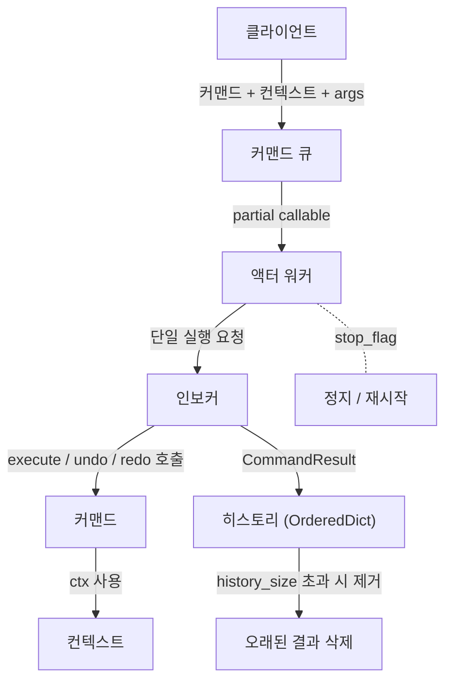

# Command Actor

큐에 커맨드를 쌓아 워커 스레드에서 실행하고, 실행 결과를 제한된 크기로 보관하는 경량 커맨드 실행기입니다.

## 구성 요소
- **Actor** (`actor.Actor`): 워커 스레드, 커맨드 큐, 크기 제한 `OrderedDict` 히스토리를 관리합니다. `start()`, `stop()`, `request_command()` API를 제공합니다.
- **_Invoker** (`actor._Invoker`): 락으로 실행을 직렬화하고 `CommandResult`(success/data/error)를 반환합니다.
- **Protocols**
  - `ContextProtocol`: 컨텍스트 제약을 최소화한 마커 프로토콜.
  - `CommandProtocol[TCtx]`: `execute/undo/redo`를 정의하는 제네릭 커맨드 프로토콜.

## 동작 요약
- 커맨드는 `request_command(cmd_instance, ctx, *args, **kwargs)` 형태로 큐에 적재됩니다.
- 워커 루프는 큐에서 하나씩 꺼내 `_Invoker.invoke`로 실행하고, 결과를 히스토리에 저장합니다.
- 대기 시간은 `elapsed`를 감안해 `max(backoff, interval - elapsed)`로 계산, CPU 사용과 지연을 균형 잡습니다.
- 히스토리는 `history_size`로 제한되며 초과 시 가장 오래된 항목부터 삭제합니다.

## 설치 & 실행 환경
- Python 3.10 (프로젝트 루트의 `.python-version` 참조)
- 의존성: 표준 라이브러리만 사용 (추가 패키지 없음)
- 실행은 `uv`로 예시: `uv run .\test\test_multi_actor.py`

## 빠른 시작
```python
from actor import Actor, CommandProtocol, ContextProtocol, CommandResult

class MyContext(ContextProtocol):
    def __init__(self, name: str) -> None:
        self.name = name

class HelloCommand(CommandProtocol[MyContext]):
    name = "HelloCommand"
    def execute(self, ctx: MyContext) -> CommandResult:
        return CommandResult(success=True, data={"msg": f"hello {ctx.name}"})
    def undo(self, ctx: MyContext) -> CommandResult:
        return CommandResult(success=True)
    def redo(self, ctx: MyContext) -> CommandResult:
        return self.execute(ctx)

actor = Actor(name="Demo", history_size=100, interval=0.1, backoff=0.05)
actor.start()
actor.request_command(HelloCommand(), MyContext("world"))
actor.stop()
```

## 주요 API
- `Actor.start() -> bool`: 워커 스레드를 시작합니다.
- `Actor.stop() -> bool`: 워커 스레드를 중단하고 종료를 기다립니다.
- `Actor.request_command(cmd: CommandProtocol, ctx: ContextProtocol, *args, **kwargs)`: 커맨드 실행을 큐에 적재합니다.
- `Actor.history -> OrderedDict[datetime, CommandResult]`: 실행 결과의 복사본을 반환합니다.

## 조정 가능한 값
- `history_size`: 히스토리에 저장할 최대 실행 결과 수. 초과 시 오래된 항목부터 삭제.
- `interval`: 워커 루프 목표 주기(초). 실행 시간이 짧으면 이 주기에 맞춰 대기.
- `backoff`: 최소 대기 시간(초). 큐가 비었을 때 또는 실행이 빨랐을 때의 하한.
- `join_timeout`: `stop()` 시 워커 스레드 종료를 기다리는 상한(초).

## 테스트
- 다중 액터 및 동시 증가 시나리오: [`test/test_multi_actor.py`](test/test_multi_actor.py)
- 실행: `uv run .\test\test_multi_actor.py`

## 구조도


## 설계 노트
- `_Invoker`는 내부 락으로 실행을 직렬화해 커맨드가 동시에 같은 리소스를 건드리는 상황을 방지합니다.
- `_history` 접근은 락으로 보호하며, 외부에는 복사본을 제공해 외부 변조를 막습니다.
- 워커 스레드는 데몬이 아니므로 `stop()`으로 명시 종료해야 리소스가 정리됩니다.

## 추가 예정
1. 큐 대기와 무관하게 즉시 실행 가능한 긴급 호출 경로
2. 히스토리 영속화/내보내기 옵션
3. 실행 결과 메트릭/트레이싱 훅