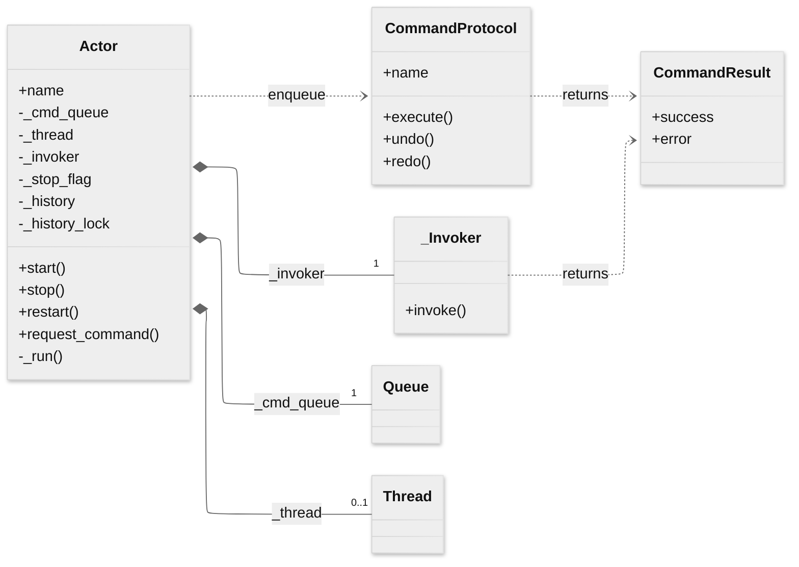
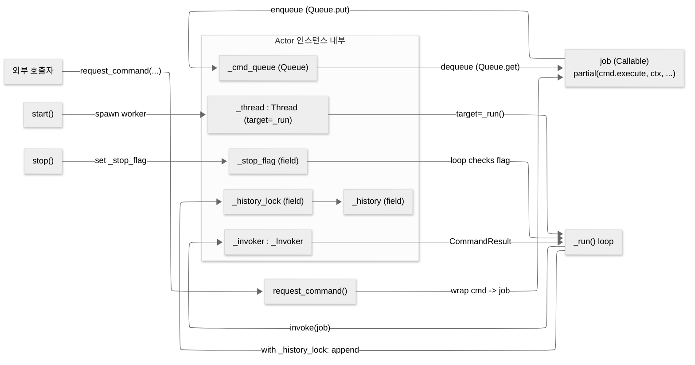

## simple-actor 코드 구조 (actor.py)

### 1) 정적 구조(클래스/필드 중심): `Actor` 내부 인스턴스가 한눈에 보이도록

---

### 2) “큐에 데이터를 넣는 경로” + 실행 스레드가 소비하는 위치(메서드 콜 관점)
> “엔트리 타는 순서(전체 시나리오)”가 아니라, **어떤 메서드가 어떤 내부 인스턴스를 건드리는지**를 표현합니다.

